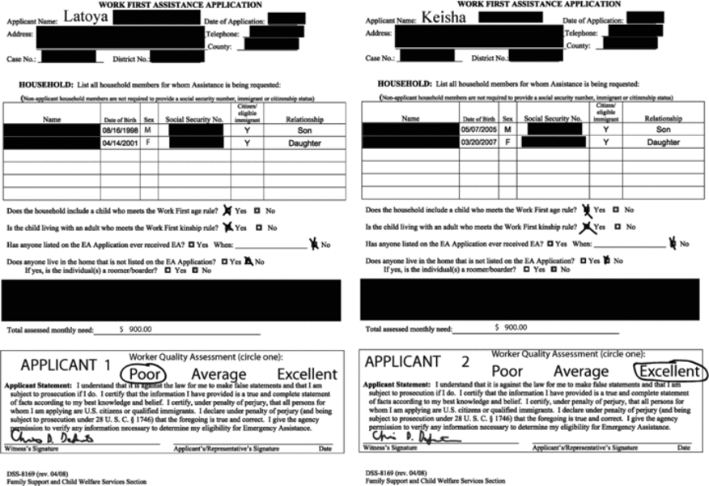

```{r setup, include=FALSE}
knitr::opts_chunk$set(
  echo = TRUE,
  warning = FALSE,
  message = FALSE,
  include = TRUE
)
```

For this assignment, we will be working with the replication dataset for Christopher DeSante's (2013) experiment exploring how people rely on ideas about "deservingness" when allocating social benefits.^[DeSante, Christopher. 2013. "Working Twice as Hard to Get Half as Far: Race, Work Ethic, and America's Deserving Poor." *American Journal of Political Science*, 57: 342-356. https://doi.org/10.1111/ajps.12006.] In this experiment, participants were given a hypothetical $1500 to allocate between two applicants for social benefits. The two applicants' profiles included identical information, except for the applicants' names and a measure of their work ethic (hardworking vs. lazy). The applicants' names were randomly assigned to be either stereotypically Black or stereotypically White. Here is an example of the profiles respondents saw:

{width=50%}

We will be using the dataset `desante2013_modified.csv` for this assignment. The fields in this dataset are:

| Variable | Description |
|----------|-------------|
| `respondent_id` | Unique identifier for each survey respondent |
| `treatment` | Treatment condition number (1-12) indicating experimental condition |
| `race` | Race of the applicant ("white", "black", or NA for control conditions) |
| `work_ethic` | Work ethic description of the applicant ("excellent", "poor", or NA for control conditions) |
| `allocation` | Dollar amount ($0-$1500) allocated to this specific applicant |
| `bal_bud` | Remaining budget balance after allocation |
| `pid` | Political party identification ("Democrat", "Republican", "Independent", or NA) |
| `age` | Age of the respondent in years |
| `gender` | Gender of the respondent ("Male", "Female") |
| `income_1000s` | Respondent's household income in thousands of dollars |

### Assignment Instructions

You must submit both a .Rmd file and knitted output in either HTML or PDF format. In addition, you **must** `echo` your code and hide any messages and warnings in your knitted output to assist the TAs in grading your work. Assignments missing either file, do not `echo` the code, or do not hide messages and warnings will receive a 2 point deduction.

Where you are asked to interpret the results of our analysis, you must include a brief written response to receive full credit for the question.

Please review the course policy on Generative AI tools in the [syllabus](https://canvas.upenn.edu/courses/1867281/assignments/syllabus).

### Assignment Questions

```{r}
library(tidyverse)
library(infer)
library(knitr)
desante <- read_csv(here::here("assignments/week5/desante2013_modified.csv"))
```

1. Conduct a t-test comparing the mean allocation to applicants described as hardworking versus those described as lazy. What do you conclude from this analysis?

```{r}
t_test(desante, allocation ~ work_ethic, order = c("excellent", "poor")) |>
  kable()
```

2. Conduct a t-test comparing the mean allocation to Black applicants versus White applicants. What do you conclude from this analysis?

```{r}
t_test(desante, allocation ~ race, order = c("white", "black")) |>
  kable()
```

3. Based on your results from questions 1 and 2, we might conclude that either work ethic or race is a more important factor in determining allocations. However, these factors may interact with one another. To explore this possibility, decide which variable (work ethic or race) to use as your independent variable, and conduct two t-tests, holding the value of the other variable constant in each one. For example, are Black hardworking applicants allocated less money than White hardworking applicants? Than lazy applicants? What do you conclude from this analysis?

```{r}
desante |>
  filter(race == "white") |>
  t_test(allocation ~ work_ethic, order = c("excellent", "poor")) |>
  kable()

desante |>
  filter(race == "black") |>
  t_test(allocation ~ work_ethic, order = c("excellent", "poor")) |>
  kable()
```

4. Let's also explore whether these relationships are confounded^[A relationship between two variables is said to be confounded when there is a third variable that explains both the change in the independent and dependent variable, e.g., the apparent causal relationship between X and Y is actually a relationship between Z and X and Z and Y, and there is no direct relationship between X and Y.] by the participant's demographic characteristics. Using the `age`, `gender`, or `income_1000s` variables, conduct two t-tests using the same independent variable you selected in quesstion 3, holding the value of one of the demographic variable constant in each one (e.g., do rich participants allocate Black applicants less money than White applicants?)

```{r}
desante_mod <- desante |>
  mutate(
    income_binary = case_when(
      income_1000s >= mean(income_1000s, na.rm = T) ~ "high_income",
      income_1000s < mean(income_1000s, na.rm = T) ~ "low_income"
    )
  )

desante_mod |>
  filter(income_binary == "high_income") |>
  t_test(allocation ~ work_ethic, order = c("excellent", "poor")) |>
  kable()

desante_mod |>
  filter(income_binary == "low_income") |>
  t_test(allocation ~ work_ethic, order = c("excellent", "poor")) |>
  kable()
```

*BONUS:* Compare the difference-in-differences between these two t-tests, e.g., is the mean of Black hardworking - White hardworking different from the mean of Black lazy - White lazy? Is the difference-in-differences statistically significant?

```{r}
work_ethic_high_income <- t.test(
  allocation ~ work_ethic,
  desante_mod[desante_mod$income_binary == "high_income", ]
)

work_ethic_low_income <- t.test(
  allocation ~ work_ethic,
  desante_mod[desante_mod$income_binary == "low_income", ]
)

work_ethic_high_samp_dist <- rnorm(
  10000,
  mean = work_ethic_high_income$estimate,
  sd = work_ethic_high_income$stderr
)

work_ethic_low_samp_dist <- rnorm(
  10000,
  mean = work_ethic_low_income$estimate,
  sd = work_ethic_low_income$stderr
)

diff_in_diff <- work_ethic_high_samp_dist - work_ethic_low_samp_dist
quantile(diff_in_diff, c(0.025, 0.975))
```

5. In the experiment, participants actually have a third option: they can allocate some or all of the money to neither applicant, instead using the money to "balance the state budget." Conduct a t-test comparing the mean unallocated amount between Democrats and Republicans. What do you conclude from this analysis?

```{r}
desante |>
  mutate(
    pid = case_when(
      pid == "Democrat" ~ "Democrat",
      pid == "Republican" ~ "Republican",
      TRUE ~ NA
    )
  ) |>
  t_test(bal_bud ~ pid, order = c("Democrat", "Republican")) |>
  kable()
```